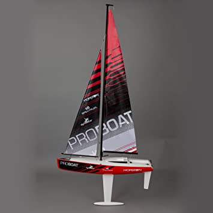

 

# Plymouth2020
Internship of 2020 on an autonomous sailboat of the University of Plymouth

## The project
The aim of the project is to develop an autonomous sailboat which will be able to learn by itself how to sail.  
To do so, I will use the work of the previous students who worked on the boat.  
The boat is using ROS with python and arduino.  

## Presentation
  
This is the boat, the Ragazza Proboat  

The sensors are : an *anenometer*, a *weather vane*, an *IMU* and a *GPS*.  
The actuators are : 2 *motors*, one for the rubber and the other for the sail.   
For the communication, we use a *RCmodule*.  
To acquire the data, we use an *arduino Mega* and to control the boat, we use a *Raspberry Pi*.  

## Summary
In this github, you will find :
* simple tests for each sensors (__components__)
* simple algorithm like line following or station keeping (__simpleAlgorithm__)
* and the workspace for the autonomous algorithm and all the other algorithms (__autonomousNavigation__)

### Other information
This internship is the second time that student work on this boat. In 2019, other students from the ENSTA Bretagne worked on the boat, I used their work to continue the project.  
So here are the link of their github for this project:  
Alexandre Coujaud:	[click here](https://github.com/AlexandreCourjaud/Stage2APlymouth "link to Alexandre's git")  
Corentin Jegat:		[click here](https://github.com/corentin-j/wrsc_plymouth_2019 "link to Corentin's git")  
Mathieu Bouveron:	[click here](https://github.com/Matthix7/plymouth_internship_2019 "link to Mathieu's git")  
