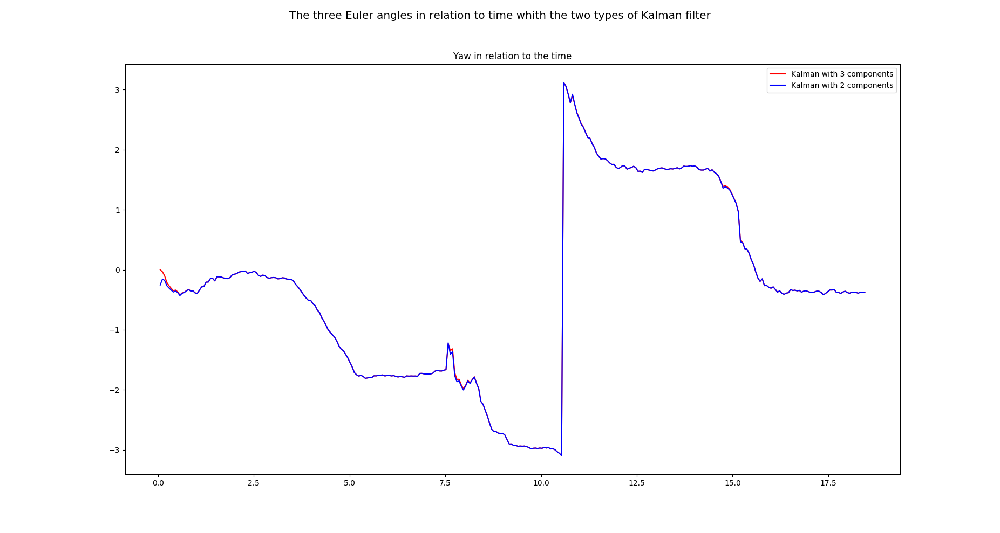

## The Validation of the new Kalman filter  

The programm `KalmanValidation.py` use the data from the .txt files and print the values of the euler angles (roll, pitch, yaw).  
In the next screenshot, we see that having a Kalman with 3 components for the state vector is not worthy.  
So, the Kalman has been change with a new way to calculate the angles with the magnetometer, and then, this Kalman filter has been implemented in the main programm for the differents launches.

,